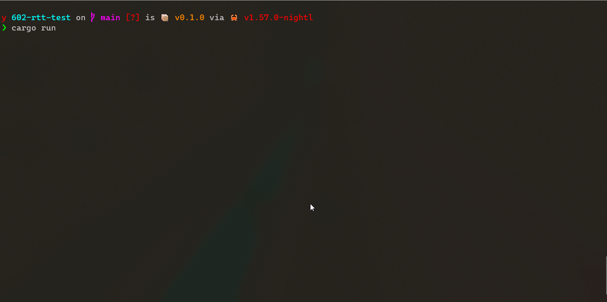

# BL602 RTT Example

This uses [jlink-rtt](https://crates.io/crates/jlink_rtt) crate to write to the RTT up-channel.

On the host side you can use [blash](https://github.com/bjoernQ/blash) with the `rtt` option. (At the time of writing it's in a branch, not on `main`)

A simple `cargo run` should flash the binary via `blash` and show the output.

